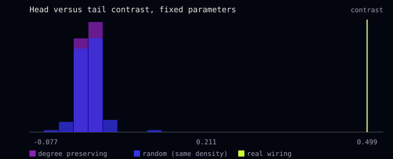
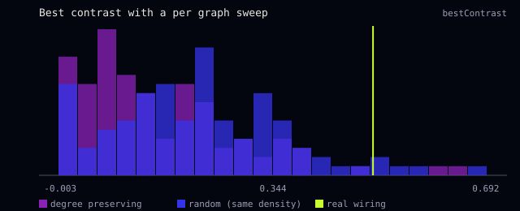
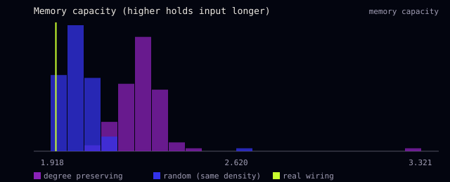

# Results

What has been measured, how, and what it shows. All numbers come from scripts in this repo and can be rerun:

```bash
npm run sweep          # scripts/sweep.mjs, about 1.5 minutes on 12 cores
npm run experiments    # scripts/null-models.mjs and scripts/reservoir.mjs, a few minutes
```

Raw outputs are in `docs/results/`. Run on 2026-10-05.

## The short version

1. **The real wiring routes head touch and tail touch differently, and shuffled wiring mostly does not.** Give the network a touch on the tail and it leans forward. Give it a touch on the head and it leans slightly backward. The gap between the two (the head versus tail contrast) is 0.51 on the real wiring at its best setting. When each of 100 degree preserving shuffles gets the same chance to find its own best setting, only 2 match or beat that. Of 100 random graphs, 5 do.
2. **This is narrower than "the worm wiring is special".** On a general memory test (the reservoir benchmark), the real wiring does slightly worse than its shuffles. So the result is about one specific routing, the one Chalfie and colleagues described in 1985, not a general advantage.
3. **Simple reflex sign checks were not a good test.** The first version of the model "passed" three backward reflexes mostly because it leaned backward whatever it was poked with. The checks below compare each reflex with random pokes instead.
4. **The steering layer is unmeasured.** The evaluation script exists and has not been run.

## 1. How a reflex is measured

A trial: start the network at rest, run 1 s, switch on a stimulus, run 1.5 s, read the **drive**. Drive is the mean activation of the forward command cells (AVB, PVC) minus that of the backward command cells (AVA, AVD, AVE). Positive means it leans forward.

| stimulus | cells poked | literature |
| --- | --- | --- |
| touch-tail | PLML, PLMR | forward (Chalfie et al. 1985) |
| touch-head | ALML, ALMR, AVM | backward (Chalfie et al. 1985) |
| nose-touch | ASH, FLP, OLQ | backward (Kaplan and Horvitz 1993) |
| noxious | ASH, ADL | backward |

Three measures, from weakest to strongest:

- **Sign.** Does drive have the expected sign? Four stimuli at three seeds gives a score out of 12.
- **Specificity.** Poke random sensory neurons instead, the same number of cells at the same strength, 50 to 100 times. Where does the real stimulus rank among those random pokes, in the expected direction? 100 means it pushed harder the right way than every random poke.
- **Head versus tail contrast.** Drive under tail touch minus drive under head touch. Chalfie et al. 1985 says this should be positive. It does not care whether the whole network leans one way, because the lean cancels.

## 2. The parameter sweep

`scripts/sweep.mjs` tries 1,470 combinations of four parameters (`chemScale`, `inhib`, `fOffset`, `threshold`). The rule for picking one was written before the results were seen:

1. A worm with no input must stay quiet for 30 s (3 active neurons or fewer) at seeds 1, 2 and 3. 759 points pass.
2. Of those, keep the best sign score. 16 points reach 12 of 12.
3. Of those, take the largest head versus tail contrast.

Chosen: `chemScale 2.4, inhib 20, fOffset 0.9, threshold 0.3`. Full table: [`results/sweep.csv`](results/sweep.csv).

| stimulus | drive (mean of 3 seeds) | specificity against 100 random pokes |
| --- | --- | --- |
| touch-tail | +0.45 | 100th percentile |
| nose-touch | -0.14 | 100th percentile |
| touch-head | -0.05 | 80th percentile |
| noxious | -0.00 | 67th percentile |

Read plainly: tail touch and nose touch are real, specific responses. Head touch leans the right way, but only weakly. Noxious is no better than a random poke.

**The best point is at the edge of the grid.** Outside it, the contrast keeps rising slowly as `chemScale` and `inhib` grow together (0.60 at `chemScale 2.7, inhib 24`). Noxious stays near zero everywhere. The grid was not widened further, so that the choice does not chase four numbers.

**Before and after the audit.** The original parameters (`chemScale 1.8, inhib 12, fOffset 0.5`) also scored 12 of 12 on signs. But their resting network ignited within 30 s, and random pokes leaned backward 80 percent of the time, so the three backward "passes" meant little. The handoff's "best was 9 of 12" could not be reproduced. Its seeds were not recorded.

## 3. Why head touch is weak

The wiring explains it. Connection weights below are in serial EM sections, the unit of the Cook et al. 2019 matrices.

| from | to forward command (AVB, PVC) | to backward command (AVA, AVD, AVE) |
| --- | --- | --- |
| AVM (head touch) | chemical: AVBL 13, AVBR 9, PVCL 10, PVCR 17 | chemical: AVDL 1, AVDR 1. Gap junction: AVDL 8 |
| ALML (head touch) | chemical: PVCL 11, PVCR 4 | chemical: AVDR 3, AVEL 3 |
| PLML (tail touch) | gap junction: PVCL 4 | chemical: AVDR 5, AVAL 4, AVAR 5. Gap junctions: AVDL 3, AVDR 2, AVAL 2, AVAR 3 |

Head touch cells send most of their chemical output to the *forward* command cells. Tail touch cells send theirs to the *backward* ones. In this model every non GABA chemical synapse excites, so a head touch pushes both ways. The backward push comes mainly through a gap junction. A likely reading is that in the animal, these chemical synapses onto the opposite direction command cells are inhibitory, through receptors the model does not represent. That is a hypothesis, not something this model tests. It would be the first thing to try with a receptor based sign map (see `NEUROTRANSMITTERS.md`).

## 4. Does the wiring matter? The null models

`scripts/null-models.mjs` builds two kinds of fake wiring (code in `src/graphs.mjs`):

- **Degree preserving** (Maslov and Sneppen 2002). Every neuron keeps exactly as many incoming and outgoing chemical connections, and as many gap junctions. Who connects to whom is shuffled by 10 swaps per edge. Weights travel with their edges.
- **Random.** The same number of chemical and gap junction connections with the same weights, placed uniformly at random.

100 of each. Neuron identities, GABA signs and which cells each stimulus pokes stay the same.

### Part A: everyone at the real wiring's parameters

| measure | real | degree preserving, mean (sd) | real beats | random, mean (sd) | real beats |
| --- | --- | --- | --- | --- | --- |
| head versus tail contrast | 0.499 | 0.000 (0.005) | 100% | 0.001 (0.019) | 100% |
| tail touch drive | 0.454 | 0.000 (0.004) | 100% | -0.001 (0.009) | 100% |
| sign score of 12 | 12 | 5.9 (2.9) | 98% | 5.0 (3.3) | 99% |

**Do not read much into Part A.** The parameters were tuned on the real wiring. At those parameters, the shuffled graphs hardly respond to input at all (section 5: under 1 neuron active against 39 on the real wiring). Beating a silent network is easy.



### Part B: every graph gets its own sweep

Each graph, real or fake, tries the same 81 parameter combinations (`chemScale` 1.2, 1.8, 2.4; `inhib` 8, 12, 16; `fOffset` 0.3, 0.5, 0.7; `threshold` 0.2, 0.3, 0.4). Settings where the resting network is busy are skipped. Each graph keeps its best.

| measure | real | degree preserving, mean (sd) | null graphs at or above real | random, mean (sd) | null graphs at or above real |
| --- | --- | --- | --- | --- | --- |
| best head versus tail contrast | 0.508 | 0.156 (0.130) | 2 of 100 | 0.224 (0.142) | 5 of 100 |
| best sign score of 12 | 12 | 10.2 (2.2) | many | 9.6 (1.9) | many |



**This is the main result.** With the same chance to tune, the real wiring separates head touch from tail touch better than 98 percent of degree preserving shuffles and 95 percent of random graphs. Keeping each neuron's number of connections is not enough to reproduce it. Who connects to whom matters. The sign score, on the other hand, is easy to reach on fake wiring, which is one more reason not to lean on it.

## 5. Reservoir benchmark

`scripts/reservoir.mjs` asks a different question: is the real wiring a better general signal processor? A random input signal drives every sensory neuron. A linear readout, trained on 2,000 steps and tested on 1,000, tries to recover past inputs (memory capacity, sum over 30 delays) and a standard nonlinear target (NARMA10, error as NRMSE, lower is better). Same parameters for every graph.

| measure | real | degree preserving, mean (sd) | real beats | random, mean (sd) | real beats |
| --- | --- | --- | --- | --- | --- |
| memory capacity (higher is better) | 1.93 | 2.27 (0.13) | 0% | 2.02 (0.08) | 1% |
| NARMA10 error (lower is better) | 0.772 | 0.767 (0.007) | 4% | 0.774 (0.004) | 78% |
| neurons active under input | 39.4 | 0.04 | | 0.03 | |



The real wiring spreads input through dozens of neurons, and the fake ones barely spread it at all. Even so, the real wiring remembers less, probably because the spread saturates and smears the signal. Most of the memory in the fake graphs sits in the sensory cells that are driven directly. **No evidence here that the real wiring is a better general reservoir.** The parameters were chosen for reflexes, not for this task, and a per graph sweep of the reservoir settings was not run.

## 6. Steering evaluation: not run

`scripts/steer-eval.mjs` implements experiments 1, 2 and 4 from `docs/research/06-steering-theory.md`: default sampling against worm steering against a random driver matched in mean and spread, over 200 prompts in `data/eval-prompts.json`. It needs a local Ollama model and **has not been run**. Nothing in this repo claims the steering changes or improves a model's replies.

```bash
node scripts/steer-eval.mjs --dry-run --limit 5          # works offline, prints the planned settings
ollama pull llama3.2 && node scripts/steer-eval.mjs      # the real run
```

Things to know before reading its results, from writing it:

- **The worm condition is close to five fixed settings.** Prompts in one category (questions, thanks, complaints, long pastes, plain statements) poke the same neurons, so they get nearly the same settings. The random condition draws fresh settings for every prompt. The two match in mean and spread, but the worm's variation is all between categories.
- **Three of the four moods occur** with these prompts, at the current parameters: reversing 40 percent, dwelling 40 percent, foraging 20 percent. The resting tone line is never exercised.
- **The random condition draws each setting on its own**, while the worm's settings move together.
- **Experiment 2 keeps the whole conversation history**, as the `connect` command does. Over 200 turns that will pass a small model's context window, and the oldest turns will be cut.

## 7. What these results do not show

- Nothing here compares the model with recordings from real worms. The obvious targets are whole brain imaging datasets (Kato et al. 2015, Atanas et al. 2023).
- Four stimuli is a small test. A held out set of reflexes the sweep never saw would be a stronger one.
- The null model result is about the head versus tail contrast. It does not show that any other property of the model depends on the real wiring.
